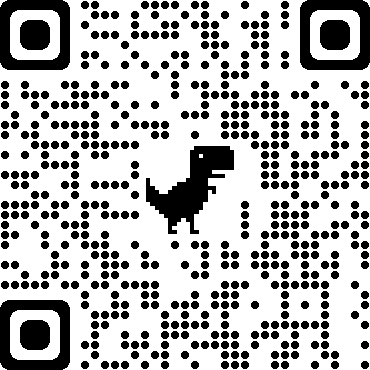
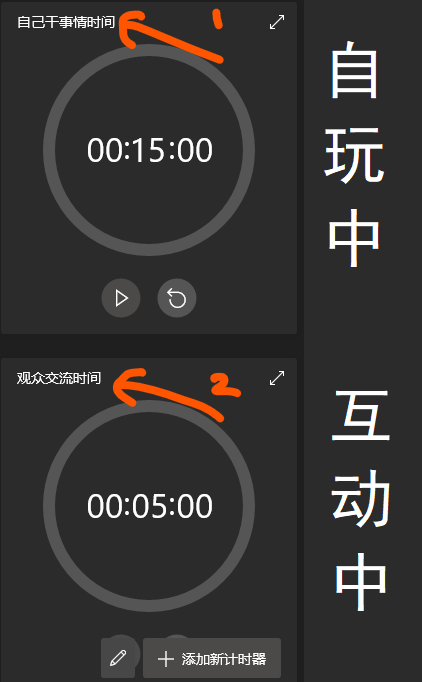

## bilibili直播相关
 - 平日9点左右 ~ 11点左右 进行直播学习,
 - 周末近期都很闲， 只要没事就可能开。
 - 目前是干了两年的前端开发，
正在努力成为高级开发工程师~
 - 欢迎各位同学来提需求~
 - [bilibili直播地址](https://live.bilibili.com/22950505)

 

 - 目前直播互动方式问题
   - 大致是15分钟主播集中干自己的
   - 5分钟跟观众交流。可以发到直播评论中~
   - 会用下面这个计时器

## 主线学习任务
- 将一直在这个页面进行更新。
- 内容变大时， 会移出去新增文本。
- 想知道主播之前以及近期以及目前在干什么， 学什么，
看这里基本就可以了~
## 一些原则
 - 参照番茄工作法。 
    - 15分钟 我自言自语的在这里学习， 敲代码。
    - 5 ~ 10分钟 看一下有没有留言， 
       - 有观众时， 交流一下
       - 没有的话， 我就活动一下
---
## Ing (直播中此刻正在做的事情-直播同步)
感谢 祁陌090： 等你PL成功记得告诉我~ 我在这里标记一下， 哈哈哈

- 写一个chrome插件
  > <del> 了解一下先 
  [Chrome浏览器插件 hellworld](https://www.jianshu.com/p/51c650f98d9c)</del>
  <del>[中文版](http://chrome.cenchy.com/)</del>
  - 什么中文版都不要看， 都是浪费时间，还是看英文文档。
  - [Chrome Developers](https://developer.chrome.com/)
  [Chrome 插件API概览](https://developer.chrome.com/extensions/api_index)

  - 阅读一下， chrome插件相关的文档
    -  <del> 看了下中文文档， browser_action </del> 不要看中文文档
  - 看一下github 有没有成熟的 框架可以用。
    - 找到一个 [vue的扩展框架](https://github.com/mubaidr/vue-chrome-extension-boilerplate)
  - 在尝试写一写

  - 需要写一个简单的canvas 
    - 写一个静态的（找回canvas api的记忆）
    - 写一个动态的渲染到这个扩展icon上

## 待办
- 每次开直播时， 把几个主要的地址发一下
  - 项目地址 - 就这个文档地址

- vue3的学习

- nuxt的学习

- 摸索自动化发布在几个平台上

- 应该有一个互相跳转平台的模板

---
## 已办
- 创建一个项目， 做文字记录，
应该有一个任务列表。

- 配置在 github 和 码云上
   在码云 和 github上初始化项目
   创建本地ssh密码
   将ssh密码配置在 码云 和 github上
   先clone 码云的项目到本地
   - 遇到一个问题， 电脑打不开 github.com， 
   [参考1](https://blog.csdn.net/qq_35572368/article/details/104564497)
   [参考2](https://blog.csdn.net/yangfan8805/article/details/81433689)
   [配合这个网站](https://www.ipaddress.com/)
   - 应该是这个找不到域名导致的。。

   - 如何添加两个远程仓库？ [参考](https://blog.csdn.net/gggg989898/article/details/108639631)

